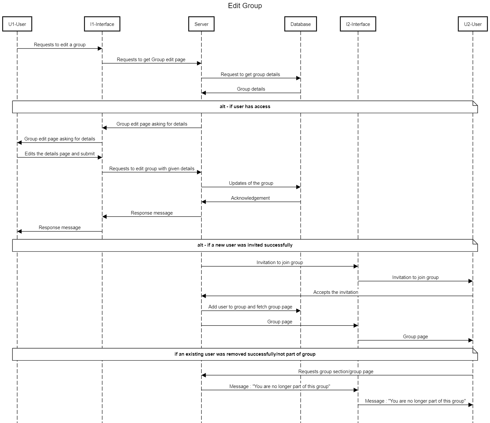

# Meeting Management System

## Software Engineering, Winter 2020

### Group 04

```
Aditya Bajaj —— Akash Tike —— Kausha Vora
Parth Maniyar —— Shaunak Vyas
Shivansh Nautiyal —— Smit Mandavia
```

## Contents


- 1 Introduction
   - 1.1 Purpose
   - 1.2 Scope
   - 1.3 Definitions, acronyms, and abbreviations
   - 1.4 References
   - 1.5 Overview
- 2 Overall Description
   - 2.1 Product Perspective
   - 2.2 Product Features
   - 2.3 User Characteristics
   - 2.4 General Constraints
   - 2.5 Design Constraints
   - 2.6 Assumptions And Dependencies
- 3 Specific Requirements
   - 3.1 External Interface Requirements
      - 3.1.1 User Interfaces
      - 3.1.2 Hardware Interfaces
      - 3.1.3 Software Interfaces
      - 3.1.4 Communication Interfaces
   - 3.2 System Features/Functional Requirements
      - 3.2.1 Authentication System
         - 3.2.1.1 Introduction/Purpose Of Feature
         - 3.2.1.2 Stimulus/Response Sequence
         - 3.2.1.3 Associated Functional Requirements
      - 3.2.2 View Priority Schedule
         - 3.2.2.1 Introduction/Purpose Of Feature
         - 3.2.2.2 Stimulus/Response Sequence
         - 3.2.2.3 Associated Functional Requirements
      - 3.2.3 View Notifications
         - 3.2.3.1 Introduction/Purpose Of Feature
         - 3.2.3.2 Stimulus/Response Sequence
         - 3.2.3.3 Associated Functional Requirements
      - 3.2.4 View/Add resources
         - 3.2.4.1 Introduction/Purpose Of Feature
         - 3.2.4.2 Stimulus/Response Sequence
         - 3.2.4.3 Associated Functional Requirements
      - 3.2.5 Entering Chat
         - 3.2.5.1 Introduction/Purpose Of Feature
         - 3.2.5.2 Stimulus/Response Sequence
         - 3.2.5.3 Associated Functional Requirements
      - 3.2.6 Edit/Add Meetings
         - 3.2.6.1 Introduction/Purpose Of Feature
         - 3.2.6.2 Stimulus/Response Sequence
         - 3.2.6.3 Associated Functional Requirements
      - 3.2.7 View Full/Edit/Import Schedule
         - 3.2.7.1 Introduction/Purpose Of Feature
         - 3.2.7.2 Stimulus/Response Sequence
         - 3.2.7.3 Associated Functional Requirements
      - 3.2.8 Edit Profile
         - 3.2.8.1 Introduction/Purpose Of Feature
         - 3.2.8.2 Stimulus/Response Sequence
         - 3.2.8.3 Associated Functional Requirements
      - 3.2.9 Group
         - 3.2.9.1 Introduction/Purpose Of Feature
         - 3.2.9.2 Stimulus/Response Sequence
         - 3.2.9.3 Associated Functional Requirements
   - 3.3 Non-Functional Requirements
      - 3.3.1 Performance Requirements
      - 3.3.2 Safety Requirements
      - 3.3.3 Security Requirements
      - 3.3.4 Software Quality Attributes
- Appendices
- A Analysis Models/Diagrams
   - A.1 Entity-Relationship Diagram
   - A.2 Use-Case Diagram
   - A.3 Data-Flow Diagram
   - A.4 State Diagram
   - A.5 Sequence Diagram
- B Issues List


## 1 Introduction

### 1.1 Purpose

This System Requirement Specification (SRS) aims to provide the readers and
users information about the system and its functions and specifications.SRS de-
scribes the data, functional and behavioral requirements of the software.

The purpose of this section is to provide the reader with general, background
information and an insight into the web application of “Meeting Management
System”. This document explains the purpose and features of the system and
the constraints under which it must operate. This document defines the require-
ments gathering process used to elicit requirements from the product stakehold-
ers.

The document also specifies the overall vision, domain, functional and non-
functional requirements that are essential to the success of this product. The
document is intended for both the stakeholders and the developers of the sys-
tem and will be used as a reference for the design and validation phases of the
project.

### 1.2 Scope

The software is applicable at the Ahmedabad University level. Its main objec-
tive is to enable people to call various types of meetings, plan activities and also
to allow the class representative to assist the faculty in order to schedule extra
lectures whenever required.

This system will result in saving enormous time and energy lost otherwise for
scheduling events and the chaos of filling the excel sheets of timetable. Also the
resource sharing and storing feature of the system will help in eradicating the
slow and vulnerable paper system. The media will now be stored in the digital
format over the system and will act as a easily available reference, whenever
needed.

### 1.3 Definitions, acronyms, and abbreviations

- MMS - Meeting Management System
- ORM - Object Relational Mapping
- SQL - Structured Query Language
- HTML - Hyper Text Markup Language
- CSS - Cascading Style Sheets
- SMTP - Simple Mail Transfer Protocol


- SES - Simple E-mail Service

### 1.4 References

- ”IEEE Recommended Practice for Software ... - MSU CSE.”http://
    [http://www.cse.msu.edu/~cse870/IEEEXplore-SRS-template.pdf](http://www.cse.msu.edu/~cse870/IEEEXplore-SRS-template.pdf)
- ”Srs template IEEE hoinongdan - SlideShare.” 7 Dec. 2017,https://
    [http://www.slideshare.net/hoinongdan/srs-template-ieee-83549269.](http://www.slideshare.net/hoinongdan/srs-template-ieee-83549269.)

### 1.5 Overview

The remainder of this document is divided into two sections. The first section,
section 2, provides the system overview and constraints for the system as well
as how it will operate from a user’s perspective.

The second remaining section, section 3, provides a more detailed system speci-
fication including design and structure. It elaborates on various business, stake-
holder as well as functional features along with some non-functional require-
ments. Section 3 of this document is made on the basis of IEEE Reference of
SRS templates and ’Feature’ based Section 3 format is selected.


## 2 Overall Description

### 2.1 Product Perspective

The MMS is a web app that is a user-friendly tool developed to assist humans
in a university environment to schedule meetings. This application enables the
users to select the date, time, venue and resources required to effectively con-
duct the meetings between the members of the group.

The product will have its Django ORM Queries to the SQL Lite database for
its integrated development environment. All the forms used in the product fol-
lows a clear and logical structure. Errors will be minimized through the use
of drop-down buttons and command buttons to eliminate the excessive use of
text input. Management of resources and meeting initiation includes searching,
adding, modifying and deleting.

### 2.2 Product Features

MMS is designed to assist managers, event organizers, class representatives, and
other users whose line of tasks deals with calling meetings, gathering a set of
people, and scheduling lectures. It shall perform the following functions:

- Add and modify schedule of him/herself
- Create and become a part of a group
- Admin can make and conduct a meeting
- Can share resources in the group
- Basic chatting in the group regarding the meeting
- Protect the database of the firm by requiring a correct and registered
    username and password

The system will operate in a graphical environment where the users interact
with the program by clicking buttons and choosing from menus. However some
specific information (e.g. any additional calendar details, conversations taking
place in the chat room, agendas or special notes of the meeting etc) requires the
user to directly input the data by typing it. It will be fully operational on any
personal computer with a Windows operating system.

### 2.3 User Characteristics

MMS is made to be used in the Ahmedabad University campus explicitly. How-
ever, the scope can be expanded to the enterprise as well to an open-source
application level. The current users of MMS include various Ahmedabad Uni-
versity members, namely - faculty, students, administrative people and other


associates. Basic computer skills of the user is required for the usage of MMS.
Following are the characteristics of the user:

- The user should be a member of the organization in which the software is
    used. (Here University)
- The user should have an auris.ahduni.edu.in account and or he/she should
    be able to add his/her schedule manually
- The user should have access to a device that supports a suitable web
    browser and should have proper internet access

### 2.4 General Constraints

Constraints can be defined as the conditions or restrictions that a system has
to comply with during the execution and development. The system must be
constructed such that it abides by the rules and regulations imposed by the
defined constraints. All constraints must be adhered to during the development
of the system. The following are the constraints of the system:

- All the users should be employed with the same organization in which the
    software is used
- Users should have an email address provided to the organization
- System must be user friendly
- The system can only access the schedules of the people of the organisation
    in which the system is deployed
- Meetings having attendees belonging outside the campus will not be pos-
    sible due to unavailability of their data

### 2.5 Design Constraints

Developers should know the technologies which will be used for development
of the system. The design should be easy to interpret and up-gradable. The
structure of models and classes should be optimally designed such that the
queries to the database is efficient.

### 2.6 Assumptions And Dependencies

User should have a clear idea of the use case of the software As this is a web-app
it is accessible 24/7 except maintenance period The network connection should
be available to use the application The system requires the user to be familiar
with web browser operations. User should be able to interact well with the
system User should allow the system to access university website account.


## 3 Specific Requirements

### 3.1 External Interface Requirements

#### 3.1.1 User Interfaces

The interface of the software will provide options for a relatively easy data input,
selection processes, and text-boxes that will be properly labeled. It will also have
a user-friendly view of the whole system with simple and easy undertaking of
action-driven processes as command buttons are functionally labeled. With all
these, target users of this software will relatively find it easy to use it.

- UI-1 : Login Screen
- UI-2 : Main interface to view priority schedule,view notifications, to add
    new meetings
- UI-3 : UI to view full/edit/import schedule
- UI-4 : UI for new/edit Meetings - edit users, shared resources, comments.
- UI-6 : UI to edit user profile

#### 3.1.2 Hardware Interfaces

To be able to run the web app based MMS, the minimum requirements of the
hardware are : a computer/mobile device that supports a web browser.

#### 3.1.3 Software Interfaces

MMS is developed to serve as a tool for conducting meetings or rescheduling
lectures when dealing with a greater number of people. Being in the web appli-
cation format, it does need an internet connection. However, the system requires
minimum specifications for the software interfaces to be able to use it efficiently.

A web browser which can support latest versions of HTML, CSS and JavaScript
will be most appreciated.

#### 3.1.4 Communication Interfaces

- CI-1 : The system shall use SQLite Database
- CI-2 : SMTP or Amazon SES for email service


### 3.2 System Features/Functional Requirements

#### 3.2.1 Authentication System

##### 3.2.1.1 Introduction/Purpose Of Feature

Authentication system will authenticate the user’s credentials and will log that
user inside the system

##### 3.2.1.2 Stimulus/Response Sequence

- Stimulus: User will fill the login credentials
    Response: Open Login page
- Stimulus: User will click on Login Button
    Response: Verify the credentials in the Database and it redirects to the
    dashboard

##### 3.2.1.3 Associated Functional Requirements

- The user will be able to log in to the system.

#### 3.2.2 View Priority Schedule

##### 3.2.2.1 Introduction/Purpose Of Feature

Schedule of the week would be displayed along with the future meetings to be
done in that week

##### 3.2.2.2 Stimulus/Response Sequence

- Stimulus: User will be able to view all the meetings in the following week
    on the dashboard
    Response: Data of all the meetings in the following week by the user from
    the data-base to front-end.

##### 3.2.2.3 Associated Functional Requirements

- User will be able to view all the meetings in the following week on the
    dashboard

#### 3.2.3 View Notifications

##### 3.2.3.1 Introduction/Purpose Of Feature

All the notifications regarding meetings would be shown to the user.


##### 3.2.3.2 Stimulus/Response Sequence

- Stimulus: User will click on the Notification button
    Response: A window will be popped showing all the unread notifications
    from the database

##### 3.2.3.3 Associated Functional Requirements

- User will be able to view all the notifications

#### 3.2.4 View/Add resources

##### 3.2.4.1 Introduction/Purpose Of Feature

User can add as well as view any resource on the meeting page

##### 3.2.4.2 Stimulus/Response Sequence

- Stimulus: User will click on resources tab on the meeting page
    Response: All the resources would be displayed on the meeting page under
    the resource section
- Stimulus: User will click on a particular resource
    Response: The resource will either open in new tab or if browser is not
    able to display, it’ll give download option
- Stimulus: User can click on add resources on the meeting page and upload
    a file
    Response: The selected file would be saved in the database

##### 3.2.4.3 Associated Functional Requirements

- User can add as well as view any resource on the meeting page

#### 3.2.5 Entering Chat

##### 3.2.5.1 Introduction/Purpose Of Feature

User can chat on the respective meeting page to communicate with the fellow
meeting members

##### 3.2.5.2 Stimulus/Response Sequence

- Stimulus: User can type a text on the respective meeting page in the
    chatroom
    Response: The text will be passed in the database and would be saved.
    The text will be displayed in the chatroom.


##### 3.2.5.3 Associated Functional Requirements

- User can chat on the respective meeting page to communicate with the
    fellow meeting members

#### 3.2.6 Edit/Add Meetings

##### 3.2.6.1 Introduction/Purpose Of Feature

User will be able to edit/add the meetings and its properties

##### 3.2.6.2 Stimulus/Response Sequence

- Stimulus: User will click on add/edit new meeting
    Response: Window will be popped fetching the users’ list from the database
    and displaying it in the newly popped window.
- Stimulus: User can check in the check-boxes of the members to form/edit
    a meeting. Also user will check in the checkbox of the members to share
    the resource with if applicable.
    Response: All the newly added member data would be passed to the
    database eventually saving it.
- Stimulus: User will request for common time slots within a range with
    some duration.
    Response: System will find every common slots within the range and
    would display it.

##### 3.2.6.3 Associated Functional Requirements

- User will be able to edit/add the meetings and its properties

#### 3.2.7 View Full/Edit/Import Schedule

##### 3.2.7.1 Introduction/Purpose Of Feature

User will be able to view/edit and import the schedule from their AURIS account

##### 3.2.7.2 Stimulus/Response Sequence

- Stimulus: User will click on auto scrape button
    Response: System will fetch the user’s schedule and extract it and even-
    tually saving it in the database. New schedule will be displayed on the
    front end


- Stimulus: User can click on edit button on respective time slot and add/edit
    the schedule Response: All the newly added schedule data would be passed
    to the database eventually saving it.

##### 3.2.7.3 Associated Functional Requirements

- User will be able to view/edit and import the schedule from their AURIS
    account

#### 3.2.8 Edit Profile

##### 3.2.8.1 Introduction/Purpose Of Feature

User will be able to view/edit the user profile

##### 3.2.8.2 Stimulus/Response Sequence

- Stimulus: User will click on edit button and fill new details
    Response: System will fetch the user’s new details and eventually save it
    in the database. New details will be updated on the front end

##### 3.2.8.3 Associated Functional Requirements

- User will be able to view/edit the user profile

#### 3.2.9 Group

##### 3.2.9.1 Introduction/Purpose Of Feature

User will be able to create/edit/view groups

##### 3.2.9.2 Stimulus/Response Sequence

- Stimulus: User will click on the groups tab to view all of his/her groups
    Response: System will fetch all the user’s group details and display them
- Stimulus: User will click on create new group and enter all the appropriate
    details
    Response: System will pass all the details to the database and would save
    it.
- Stimulus: User will click on any of the group
    Response: System will fetch all the group details and display it.


- Stimulus: User will click on edit group and fill the appropriate details
    Response: System will pass all the details to the database and would save
    it.

##### 3.2.9.3 Associated Functional Requirements

- User will be able to create/edit/view groups

### 3.3 Non-Functional Requirements

#### 3.3.1 Performance Requirements

Although the system is a simple one, it needs a literate meeting caller in order
to properly select the candidates, send invites and share resources. The system
should be able to serve all the users of the university.The system should be able
to handle all the requests with minimum response time and maximum through-
put. The scraping of schedule from university website should be efficient and
should generate efficient results. Efficient storage and retrieval of data of the
users is also a major requirement.

System must store up to 5000 employees data (email id,name,designation etc)
at a time. The User interface screen should show within maximum of three
seconds.

#### 3.3.2 Safety Requirements

Different information is entered into the database such as one’s own updated
schedule, resources for various meetings, attendees for various meetings etc.
Mismanagement of information might cause participant dissatisfaction that will
eventually lead to misunderstandings and make the MMS inefficient, only be-
cause of mistakes on giving information.

Additionally, the system shall keep the log of all errors so that one can see
it anytime and work for its correction.

#### 3.3.3 Security Requirements

The web app based MMS works on the login credential basis. Therefore, all
the users who are eligible to use MMS, will have an account on this domain.
Therefore, the system always requires, a user to identity himself/herself before
calling any meeting or rescheduling the lectures.

Nobody should be allowed to tamper with data like the meeting resources and
decision documents uploaded. Enhanced Security should be given for sensitive
data. It should be made sure that only users who are given specific rights can
access data and all actions are logged, thus providing an extensive role based


authorization.

Additionally, there should be an easy back-up feature for the entire data, to
prevent losing any data.

#### 3.3.4 Software Quality Attributes

The system should be easy to use. The main purpose of the system is to save
user’s time and the system should be able to fulfill this. The software should
be robust enough to give smooth user experience throughout the usage of the
process.

Additionally, the system should be able to work on any of the modern browsers
like Firefox / Explorer / Opera / Chrome, and any of the common Operating
Systems like Linux, Windows and Mac OS.


## Appendices

## A Analysis Models/Diagrams

### A.1 Entity-Relationship Diagram


### A.2 Use-Case Diagram


### A.3 Data-Flow Diagram


### A.4 State Diagram


### A.5 Sequence Diagram





## B Issues List

- User authentication is required to access the auris website. We are working
    on automating that process.


